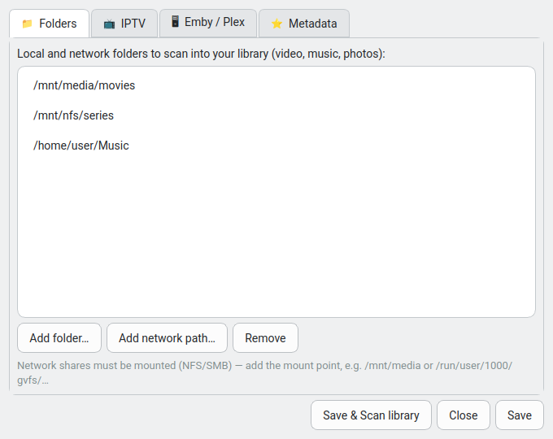

# QMediaCenter

A **Qt6 (PySide6) + libmpv** media center: IPTV (Xtream Codes), a self-built
library for local and network media, and optional Emby/Plex integration —
with posters and **IMDb ratings**.

- Embedded mpv player (OpenGL render API → works on Wayland *and* X11) with
  full hardware decoding (VAAPI) and every codec mpv supports (HEVC, AC-3,
  E-AC3, DTS, …).
- **IPTV**: Live TV, Movies (VOD) and Series browsing, with downloads.
- **Own library**: scan local and network (NFS/SMB-mounted) folders for video,
  music and photos; filenames are parsed into titles, enriched with posters,
  overviews and IMDb ratings.
- **Continue Watching**: resume positions and favourites, shared across sources.
- **Sources menu** in-app: add folders, IPTV accounts, Emby/Plex servers and
  metadata API keys — nothing is hard-coded.
- KDE Breeze Light theme; accent follows the desktop.

## Screenshots

| Home | Library | Sources |
|------|---------|---------|
|  |  |  |

A rowed home screen (Continue Watching / Favorites / Recently Added), a poster
library scanned from your folders, and an in-app Sources menu to add everything.

## Architecture

```
main.py                entry point (QApplication + login + main window)
iptv/
  xtream.py            Xtream Codes API client
  config.py            profiles / settings + media-center config
  mpv_widget.py        QOpenGLWidget that renders libmpv
  downloader.py        threaded HTTP download manager
  image_loader.py      async poster/thumbnail loader with disk cache
media/
  library_db.py        SQLite: resume, favourites, scanned media, meta cache
  metadata.py          TMDb (posters/overview) + OMDb (IMDb rating)
  local_scanner.py     local/network folder scanner + filename parser
ui/
  login_dialog.py      Xtream profile entry / selection
  sources_dialog.py    Sources & settings menu
  main_window.py       navigation + content/library pages + player
  style.py             KDE Breeze Light Qt stylesheet
```

## Metadata keys (optional)

Posters and IMDb ratings need free API keys, entered in **⚙ Sources → Metadata**:

- [TMDb](https://www.themoviedb.org/settings/api) — posters, overviews, IMDb id
- [OMDb](https://www.omdbapi.com/apikey.aspx) — IMDb rating

The library works without them; you just won't get artwork or ratings.

## Tested

- `test_ui.py` — end-to-end UI flow against a fake Xtream client.
- Library DB, scanner and metadata paths covered by headless checks.
