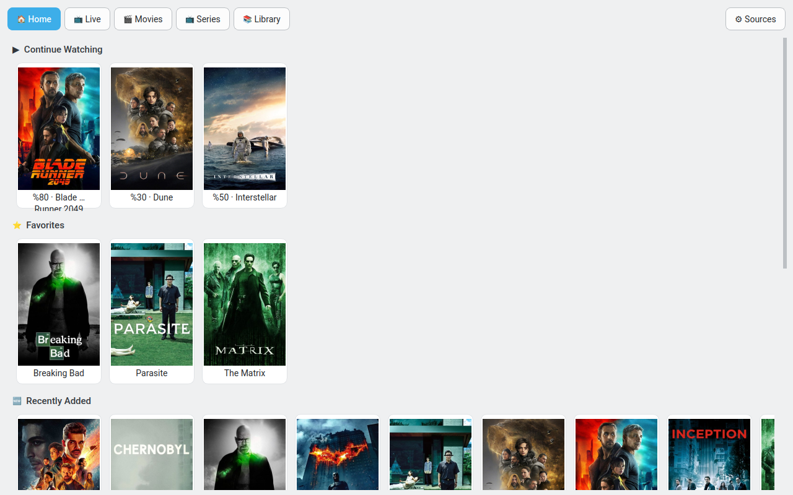
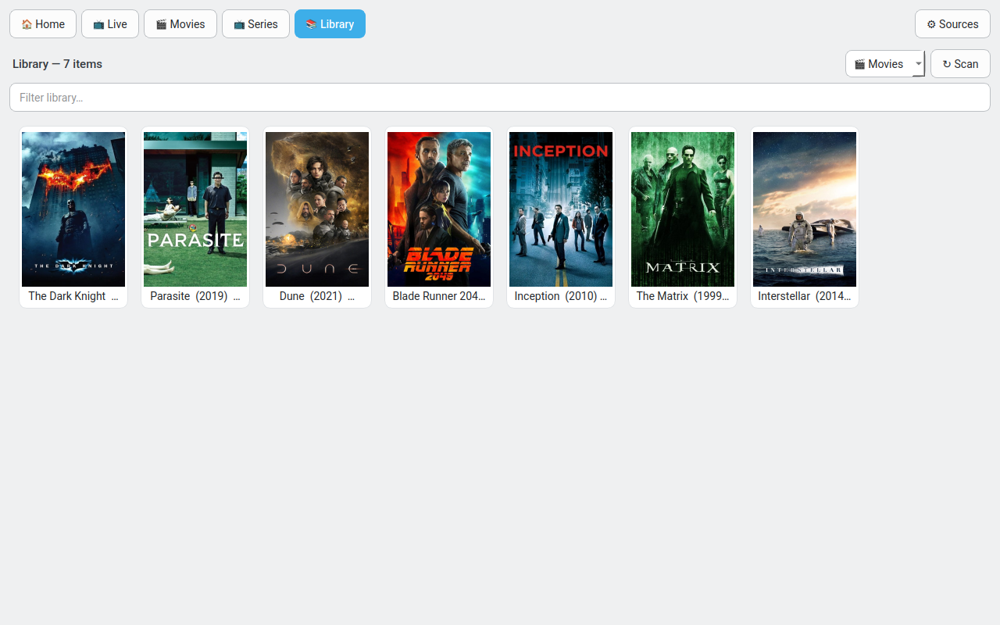
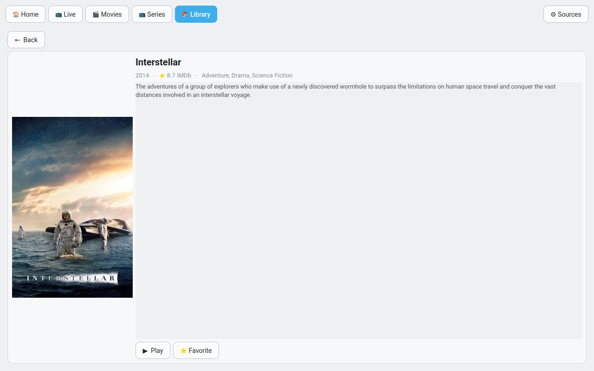
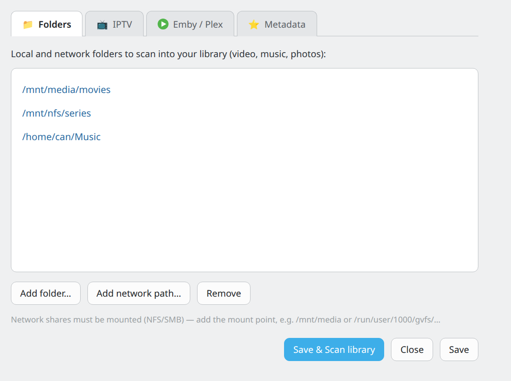

# QMediaCenter

> A lightweight, open-source media center built with **Qt6 (PySide6)** and **libmpv** — bringing together IPTV, Emby, Plex, and your own local media library in one unified interface.


---

## Features

- **IPTV (Xtream Codes)** — Live TV, Movies (VOD) and Series, with category browsing, full-catalog search by title, and downloads
- **Emby & Plex** — browse and play your server libraries directly, with auto user detection
- **Local / network library** — scan folders (NFS, SMB, USB) for video, music and photos; filenames parsed into titles, enriched with posters and IMDb ratings
- **Hardware decoding** — VAAPI on Linux (Intel, AMD); every codec mpv supports: HEVC, AV1, H.264, AC-3, DTS, …
- **Continue Watching** — resume positions saved across all sources; favourites list
- **Home screen** — rows for Continue Watching, Favourites, Recently Added, and Movies per source (Emby / Plex / local)
- **Source badges** — every item in the home screen shows which source it comes from
- **Alphabetical sorting** — movie and series lists sorted A→Z throughout
- **In-app Sources menu** — add IPTV accounts, Emby/Plex servers, local folders and metadata API keys; nothing hard-coded
- **Wayland & X11** — mpv renders via OpenGL render API; works on both
- **KDE Breeze Light** theme; accent colour follows the desktop

## Screenshots

| Home | Library |
|------|---------|
|  |  |
| **Detail** | **Sources** |
|  |  |

## Installation

### Debian / Ubuntu

```bash
wget https://github.com/ycderman/qmediacenter/releases/latest/download/qmediacenter_amd64.deb
sudo apt install ./qmediacenter_amd64.deb
```

### Fedora / openSUSE / RHEL

```bash
wget https://github.com/ycderman/qmediacenter/releases/latest/download/qmediacenter_x86_64.rpm
sudo dnf install ./qmediacenter_x86_64.rpm
```

### NixOS

```nix
# pkgs/qmediacenter.nix — see the file in this repo for the full derivation
pkgs.callPackage ./pkgs/qmediacenter.nix { }
```

### From source

```bash
git clone https://github.com/ycderman/qmediacenter
cd qmediacenter
# Install dependencies: PySide6, python-mpv, PyOpenGL, requests, yt-dlp
pip install pyside6 mpv pyopengl requests yt-dlp
python main.py
```

## Navigation

```
🏠 Home          Rows: Continue Watching · Favourites · Recently Added · Movies by source
🗂 MyMedia       Scanned local / network media (video, music, photos)
🟢 Emby          Browse and play your Emby server library
🟡 Plex          Browse and play your Plex server library
📺 IPTV ──┬─ 📡 Live      All live channels; search by channel name
           ├─ 🎬 Movies   VOD catalogue; alphabetical
           ├─ 📺 Series   Series catalogue; alphabetical
           └─ ⬇ Downloads Active and finished downloads
⚙ Sources        Add / edit IPTV accounts, Emby, Plex, local folders, API keys
```

## Architecture

```
main.py                entry point — QApplication + login + main window
iptv/
  xtream.py            Xtream Codes API client
  config.py            profiles / settings + media-center config
  mpv_widget.py        QOpenGLWidget rendering libmpv via OpenGL render API
  downloader.py        resumable threaded HTTP download manager
  image_loader.py      async poster / thumbnail loader with disk cache
media/
  library_db.py        SQLite: resume positions, favourites, scanned media, meta cache
  metadata.py          TMDb (posters / overview) + OMDb (IMDb rating)
  local_scanner.py     local / network folder scanner + filename parser
  emby.py              Emby library sync
  plex.py              Plex library sync
ui/
  login_dialog.py      Xtream profile entry / selection
  sources_dialog.py    Sources & settings dialog
  main_window.py       navigation, content / library pages, player, home screen
  style.py             KDE Breeze Light Qt stylesheet
```

## Optional metadata (posters & ratings)

Enter free API keys in **⚙ Sources → Metadata**:

| Service | What it provides | Sign up |
|---------|-----------------|---------|
| [TMDb](https://www.themoviedb.org/settings/api) | Posters, overviews, IMDb ID | Free |
| [OMDb](https://www.omdbapi.com/apikey.aspx) | IMDb rating | Free (1 000 req/day) |

The library works without them — you just won't get artwork or ratings.

## Requirements

- Python 3.11+
- PySide6 ≥ 6.5
- python-mpv
- PyOpenGL
- libmpv (system package)
- requests, yt-dlp

## License

[MIT](LICENSE)
